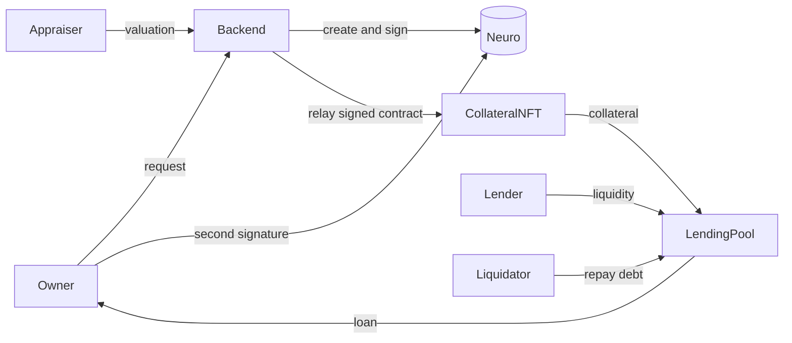

# Borgen

RWA-backed lending protocol.

Borgen lets owners of real-world assets borrow against them on-chain. A verified
appraiser signs the asset's valuation on Neuro, the signed agreement is relayed
to Base Sepolia as a collateral token, and the owner borrows against it from a
shared lending pool.

## How it works

1. The owner requests a valuation for an asset.
2. A verified appraiser reviews it and signs a valuation contract on Neuro.
3. The owner accepts and signs the same contract.
4. Once both signatures are in place, the relayer mints a collateral token that
   carries the Neuro contract id, the valuation and the owner's wallet address.
5. The owner deposits the token and borrows up to 50% of its value.
6. Repaying the loan with interest returns the token.
7. If the debt passes 80% of the collateral value, or the loan is overdue,
   anyone can repay the debt and take the token.



## Architecture

- **Neuro** holds the legal identities and the signed valuation contracts.
  Identity state and signatures are read live from the Agent API.
- **Smart contracts** (Solidity, Foundry, Base Sepolia) hold the collateral
  token, the mock stablecoin and the lending pool.
- **Backend** (Express, TypeScript, MongoDB) is the API for the frontend, the
  relayer between Neuro and the chain, and an indexer for pool events.
- **Frontend** (Next.js, TypeScript, wagmi, viem, RainbowKit) has one panel per
  role plus a public liquidations page.

The source of truth is Neuro for identities and valuations, and the chain for
collateral and loans. MongoDB only stores what those two cannot serve quickly:
requests in progress, role mapping and an activity feed.

## Roles

- **Borrower** requests valuations, accepts them, borrows and repays.
- **Appraiser** reviews requests, signs valuations and can re-value issued
  collateral.
- **Lender** provides liquidity to the pool and earns interest.
- Anyone can liquidate an unhealthy position.

## Loan terms

| Parameter | Value |
| --- | --- |
| Loan-to-value | 50% of the appraised value |
| Liquidation threshold | debt above 80% of the current value |
| Interest | 10% per year, simple |
| Duration | 30 days |

## Deployed contracts (Base Sepolia)

| Contract | Address |
| --- | --- |
| MockStablecoin | [0x7936Fca300Cb1Cd11260E010f484655893af38fb](https://sepolia.basescan.org/address/0x7936fca300cb1cd11260e010f484655893af38fb) |
| CollateralNFT | [0x1723AFC405269744e750bEd61544963506A06f9C](https://sepolia.basescan.org/address/0x1723afc405269744e750bed61544963506a06f9c) |
| LendingPool | [0x95ffF8cC64aE1411B4D29238d35a908d02A2F802](https://sepolia.basescan.org/address/0x95fff8cc64ae1411b4d29238d35a908d02a2f802) |

## Project structure

- `contracts/` Solidity contracts, tests and the deployment script
- `backend/` Express API, Neuro client, relayer and event indexer
- `frontend/` Next.js app
- `docs/` notes gathered while integrating Neuro

## Running locally

Requires Node.js 24, Foundry and a MongoDB connection string.

```bash
# contracts
cd contracts
forge test

# backend
cd backend
npm install
cp .env.example .env   # fill in the values
npm run dev

# frontend
cd frontend
npm install
cp .env.example .env.local   # fill in the values
npm run dev
```

The backend signs Neuro requests with sandbox accounts and relays transactions
with its own wallet, so `backend/.env` holds both Neuro credentials and the
relayer key. The frontend only needs the API url and a WalletConnect project id.

## MVP limitations

- Neuro signatures are produced by the backend with sandbox account
  credentials. In a real deployment each signature must be created on the
  signer's own device.
- The appraiser allowlist is a single sandbox identity configured in the
  environment.
- Re-valuing an asset updates the chain only; a complete flow would create and
  sign a new Neuro valuation contract first.
- Loans are repaid in full, and a liquidation transfers the whole collateral to
  the liquidator without returning the surplus to the borrower.
- The stablecoin is a mock token anyone can mint.
- The physical side of custody and inspection is out of scope.

## Notes

`docs/neuro-notes.md` records how the Neuro Agent API behaves in practice,
including the parts that differ from the documentation.
